# gem5 Stats Analysis Backend — Complete Technical Documentation

> **Production-ready Python Flask backend** for parsing gem5 `stats.txt` simulation output files and exposing extracted and derived metrics through a structured REST API for visualization dashboards.

---

## Table of Contents

1. [System Overview](#1-system-overview)
2. [Architecture Diagram](#2-architecture-diagram)
3. [Data Flow Diagrams (DFD)](#3-data-flow-diagrams-dfd)
   - [Level 0 — Context Diagram](#level-0--context-diagram)
   - [Level 1 — Main Processes](#level-1--main-processes)
   - [Level 2 — Upload & Parse Subprocess](#level-2--upload--parse-subprocess)
   - [Level 2 — Metrics Retrieval Subprocess](#level-2--metrics-retrieval-subprocess)
4. [Component Interaction Diagram](#4-component-interaction-diagram)
5. [Class Diagram](#5-class-diagram)
6. [Sequence Diagrams](#6-sequence-diagrams)
   - [Upload Flow](#upload-flow)
   - [Metrics Retrieval Flow](#metrics-retrieval-flow)
7. [State Machine — File Lifecycle](#7-state-machine--file-lifecycle)
8. [Project Structure](#8-project-structure)
9. [Setup & Installation](#9-setup--installation)
10. [Running the Server](#10-running-the-server)
11. [API Reference](#11-api-reference)
    - [POST /upload](#post-upload)
    - [GET /metrics/\<file_id\>](#get-metricsfile_id)
    - [GET /metrics/cpu/\<file_id\>](#get-metricscpufile_id)
    - [GET /metrics/simulation/\<file_id\>](#get-metricssimulationfile_id)
    - [GET /metrics/derived/\<file_id\>](#get-metricsderivedfile_id)
    - [GET /health](#get-health)
12. [Derived Metrics Reference](#12-derived-metrics-reference)
13. [Parsing Pipeline Deep-Dive](#13-parsing-pipeline-deep-dive)
14. [Regex Specification](#14-regex-specification)
15. [Validation Rules](#15-validation-rules)
16. [Caching Strategy](#16-caching-strategy)
17. [Error Handling Reference](#17-error-handling-reference)
18. [Configuration Reference](#18-configuration-reference)
19. [Logging Reference](#19-logging-reference)
20. [Running Tests](#20-running-tests)
21. [Design Principles & SOLID](#21-design-principles--solid)
22. [Extending the Backend](#22-extending-the-backend)
23. [Performance Characteristics](#23-performance-characteristics)
24. [Security Considerations](#24-security-considerations)
25. [Deployment Guide](#25-deployment-guide)

---

## 1. System Overview

The backend ingests **gem5 architectural simulation output files** (`stats.txt`) through a REST upload endpoint, processes them through a multi-stage analysis pipeline, and serves the structured results through category-specific read endpoints.

```
┌─────────────┐        HTTP         ┌──────────────────────────────────────┐
│  Dashboard  │ ←────────────────→  │        Flask Backend (port 5000)     │
│  (React /   │   REST JSON API     │                                      │
│   Vue / CLI)│                     │  POST /upload  →  GET /metrics/*     │
└─────────────┘                     └──────────────────────────────────────┘
                                                       │
                                              ┌────────┴────────┐
                                              │  stats.txt file │
                                              │  (gem5 output)  │
                                              └─────────────────┘
```

**Key design goals:**

| Goal | Decision |
|------|----------|
| O(n) single-pass parsing | Line-by-line streaming with compiled regex |
| Zero-config metric discovery | Any metric in the file is auto-extracted |
| Clean separation of concerns | 5 distinct service classes, each one responsibility |
| Future file format support | `StatsParser` is swappable; new parsers plug in |
| Type safety | Pydantic v2 models for all API contracts |

---

## 2. Architecture Diagram

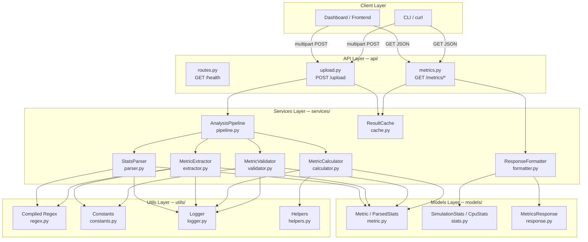

---

## 3. Data Flow Diagrams (DFD)

### Level 0 — Context Diagram

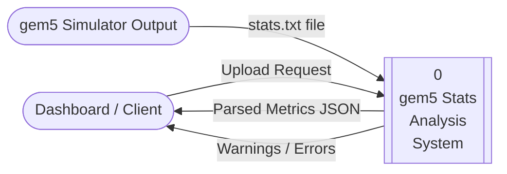

---

### Level 1 — Main Processes

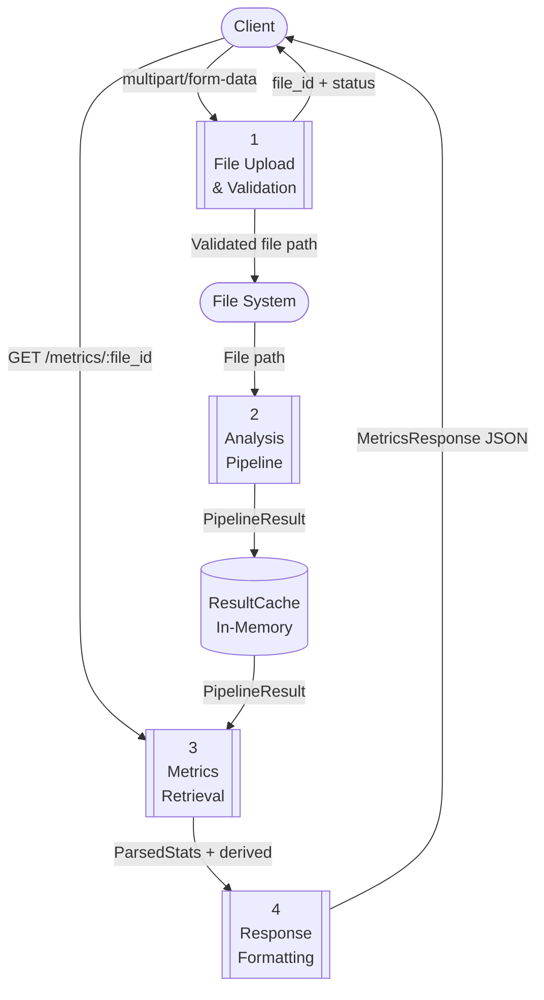

---

### Level 2 — Upload & Parse Subprocess

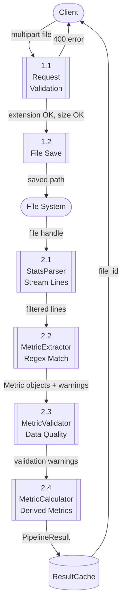

---

### Level 2 — Metrics Retrieval Subprocess

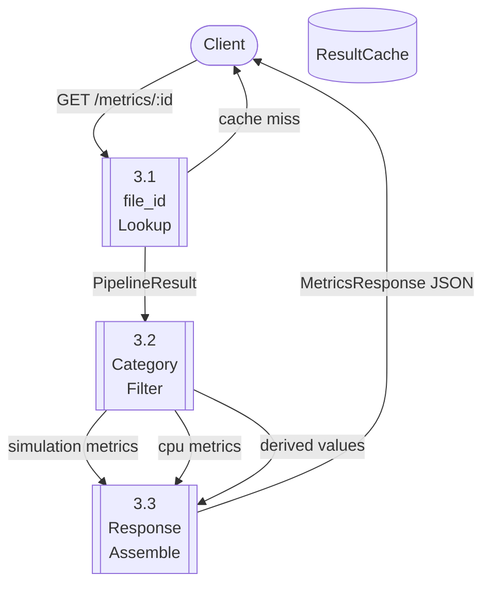

---

## 4. Component Interaction Diagram

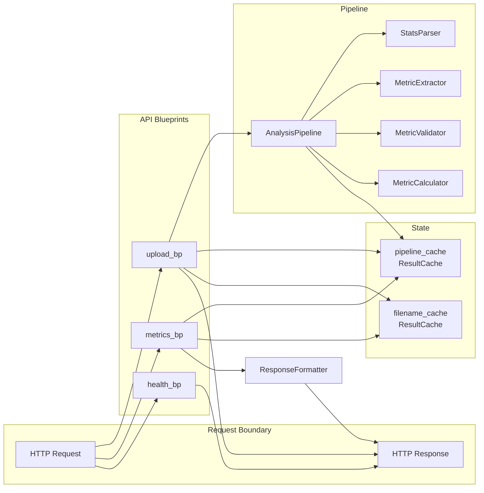

---

## 5. Class Diagram

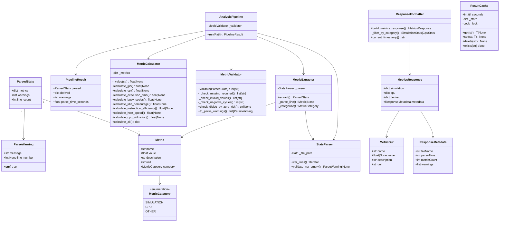

---

## 6. Sequence Diagrams

### Upload Flow

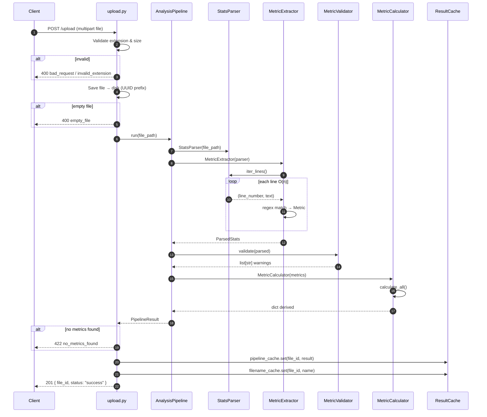

---

### Metrics Retrieval Flow

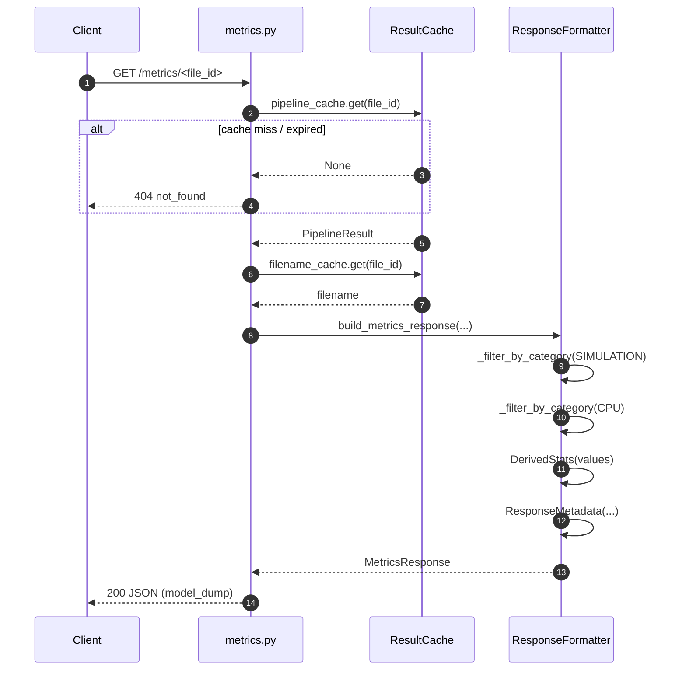

---

## 7. State Machine — File Lifecycle

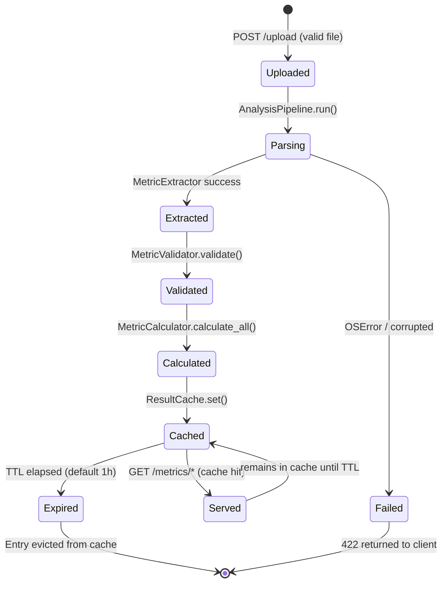

---

## 8. Project Structure

```
backend/
│
├── app.py                    # Flask application factory + error handlers
├── config.py                 # Config / TestConfig classes
├── requirements.txt          # Pinned Python dependencies
│
├── api/                      # HTTP boundary — blueprints only, no business logic
│   ├── __init__.py
│   ├── routes.py             # health_bp + register_routes()
│   ├── upload.py             # upload_bp  →  POST /upload
│   └── metrics.py            # metrics_bp →  GET /metrics/*
│
├── services/                 # Business logic — one class per file
│   ├── __init__.py
│   ├── pipeline.py           # AnalysisPipeline orchestrator + PipelineResult
│   ├── parser.py             # StatsParser — streaming O(n) line iterator
│   ├── extractor.py          # MetricExtractor — regex-driven, zero hardcoded names
│   ├── calculator.py         # MetricCalculator — pure derived-metric functions
│   ├── validator.py          # MetricValidator — data-quality guard
│   ├── formatter.py          # ResponseFormatter — builds Pydantic response objects
│   └── cache.py              # ResultCache — thread-safe TTL in-memory cache
│
├── models/                   # Data contracts
│   ├── __init__.py
│   ├── metric.py             # Metric, MetricCategory, ParseWarning, ParsedStats (dataclasses)
│   ├── stats.py              # MetricOut, SimulationStats, CpuStats, DerivedStats (Pydantic)
│   └── response.py           # MetricsResponse, ResponseMetadata, UploadResponse (Pydantic)
│
├── utils/                    # Stateless utilities
│   ├── __init__.py
│   ├── regex.py              # Compiled patterns (METRIC_LINE_PATTERN, etc.)
│   ├── constants.py          # Required metrics, category prefixes, file limits
│   ├── logger.py             # get_logger() factory — configures root logger once
│   └── helpers.py            # safe_float(), safe_divide(), generate_file_id()
│
├── uploads/                  # Runtime upload directory (git-ignored)
│   └── sample_stats.txt      # Representative gem5 stats file for dev/test
│
├── tests/                    # pytest suite
│   ├── __init__.py
│   ├── conftest.py           # Fixtures: sample_stats_path, app, client, uploaded_file_id
│   ├── test_parser.py        # StatsParser + MetricExtractor unit tests
│   ├── test_calculator.py    # MetricCalculator unit tests
│   ├── test_validator.py     # MetricValidator unit tests
│   └── test_api.py           # REST API integration tests
│
└── docs/                     # Documentation
    ├── README.md             # This file — full technical documentation
    └── example_response.json # Sample /metrics/<id> response body
```

---

## 9. Setup & Installation

### Prerequisites

| Requirement | Version |
|------------|---------|
| Python | 3.12+ |
| pip | latest |
| venv | bundled with Python |

### Steps

```bash
# 1. Navigate to the backend directory
cd /path/to/gtrace/backend

# 2. Create and activate a virtual environment
python -m venv venv
source venv/bin/activate          # Linux / macOS
# venv\Scripts\activate           # Windows PowerShell

# 3. Install all dependencies
pip install -r requirements.txt

# 4. Verify installation
python -c "import flask, pydantic; print('OK')"
```

### `requirements.txt`

```
Flask>=3.0,<4.0
pydantic>=2.6,<3.0
pandas>=2.2,<3.0
pytest>=8.0,<9.0
pytest-cov>=5.0,<6.0
black>=24.0,<25.0
ruff>=0.4,<1.0
```

---

## 10. Running the Server

```bash
# Development mode (auto-reload on code change)
FLASK_DEBUG=1 python app.py

# Flask CLI equivalent
FLASK_APP=app.py FLASK_DEBUG=1 flask run --host=0.0.0.0 --port=5000

# Production (use gunicorn or similar WSGI server)
gunicorn "app:create_app()" --bind 0.0.0.0:5000 --workers 4
```

The server starts at `http://localhost:5000`.

---

## 11. API Reference

### Base URL

```
http://localhost:5000
```

### Common Response Headers

```
Content-Type: application/json
```

---

### `POST /upload`

Upload a gem5 `stats.txt` file for analysis.

**Request**

| Field | Type | Description |
|-------|------|-------------|
| `file` | multipart file | The `stats.txt` file to analyze |

```bash
curl -X POST http://localhost:5000/upload \
  -F "file=@/path/to/stats.txt"
```

**Success Response — 201 Created**

```json
{
  "file_id": "a1b2c3d4e5f6a1b2c3d4e5f6a1b2c3d4",
  "status": "success"
}
```

**Error Responses**

| HTTP | `error` field | Condition |
|------|--------------|-----------|
| 400 | `bad_request` | Missing `file` field in form data |
| 400 | `bad_request` | Filename is empty |
| 400 | `invalid_extension` | File suffix is not `.txt` |
| 400 | `empty_file` | Uploaded file is zero bytes |
| 422 | `no_metrics_found` | File parsed but contained no valid metrics |
| 422 | `corrupted_file` | File could not be parsed (malformed content) |
| 500 | `upload_failed` | OS-level error saving the file |

**Error Envelope Format**

```json
{
  "error": "invalid_extension",
  "message": "Only ['.txt'] files are accepted"
}
```

---

### `GET /metrics/<file_id>`

Returns the complete analysis: simulation metrics, CPU metrics, derived metrics, and metadata.

```bash
curl http://localhost:5000/metrics/a1b2c3d4e5f6a1b2c3d4e5f6a1b2c3d4
```

**Success Response — 200 OK**

```json
{
  "simulation": {
    "simSeconds": {
      "name": "simSeconds",
      "value": 0.000307,
      "description": "Number of seconds simulated",
      "unit": "s"
    },
    "simTicks": { "name": "simTicks", "value": 307332500.0, "description": "...", "unit": "" }
  },
  "cpu": {
    "system.cpu.numCycles": {
      "name": "system.cpu.numCycles",
      "value": 614665.0,
      "description": "Number of cpu cycles simulated",
      "unit": ""
    }
  },
  "derived": {
    "ipc": 1.0,
    "cpi": 1.0,
    "executionTimeSeconds": 0.000307,
    "busyCycles": 614665.0,
    "idlePercentage": 0.0,
    "instructionEfficiency": 1.0,
    "hostSpeedInstsPerSec": 499728.0,
    "cpuUtilizationPercentage": 100.0
  },
  "metadata": {
    "fileName": "stats.txt",
    "parseTime": "0.001234s",
    "metricCount": 27,
    "warnings": [
      "Malformed metric line: 'this is a malformed line without a numeric value'"
    ]
  }
}
```

**404 Response** — when `file_id` is unknown or cache has expired:

```json
{
  "error": "not_found",
  "message": "Unknown file_id 'a1b2c3d4...'"
}
```

---

### `GET /metrics/cpu/<file_id>`

Returns only CPU-category metrics.

**Response Keys:** `cpu`, `metadata`

```bash
curl http://localhost:5000/metrics/cpu/<file_id>
```

```json
{
  "cpu": {
    "system.cpu.numCycles": { "name": "...", "value": 614665.0, "description": "...", "unit": "" },
    "system.cpu.ipc":       { "name": "...", "value": 1.0,      "description": "...", "unit": "" }
  },
  "metadata": { "fileName": "stats.txt", "parseTime": "...", "metricCount": 27, "warnings": [] }
}
```

---

### `GET /metrics/simulation/<file_id>`

Returns only simulation-category metrics.

**Response Keys:** `simulation`, `metadata`

```bash
curl http://localhost:5000/metrics/simulation/<file_id>
```

---

### `GET /metrics/derived/<file_id>`

Returns only calculated/derived metrics.

**Response Keys:** `derived`, `metadata`

```bash
curl http://localhost:5000/metrics/derived/<file_id>
```

---

### `GET /health`

Liveness check endpoint for monitoring and load balancers.

```bash
curl http://localhost:5000/health
```

**Response — 200 OK**

```json
{ "status": "ok" }
```

---

## 12. Derived Metrics Reference

All derived metrics are computed by `MetricCalculator` in [`services/calculator.py`](../services/calculator.py). Each function is pure: no side effects, no mutation.

| Derived Key | Formula | Required Inputs | Notes |
|-------------|---------|----------------|-------|
| `ipc` | `instsIssued / numCycles` | `system.cpu.ipc` or `instsIssued` + `numCycles` | Prefers reported value |
| `cpi` | `numCycles / instsIssued` | `system.cpu.cpi` or `numCycles` + `instsIssued` | Prefers reported value |
| `executionTimeSeconds` | `simSeconds` | `simSeconds` | Direct metric passthrough |
| `busyCycles` | `instsAdded × cpi` | `instsAdded` + calculable `cpi` | Estimates productive cycles |
| `idlePercentage` | `(numCycles - busyCycles) / numCycles × 100` | `numCycles` + `busyCycles` | Clamped to [0, 100] |
| `instructionEfficiency` | `instsAdded / instsIssued` | `instsAdded` + `instsIssued` | Fraction in [0, 1] |
| `hostSpeedInstsPerSec` | `hostInstRate` | `hostInstRate` | Direct metric passthrough |
| `cpuUtilizationPercentage` | `100 - idlePercentage` | Calculable `idlePercentage` | Clamped to [0, 100] |

> **Null semantics:** A derived value is `null` (JSON) / `None` (Python) when any required input is missing or a divide-by-zero condition is detected. The API consumer must handle `null` gracefully.

---

## 13. Parsing Pipeline Deep-Dive

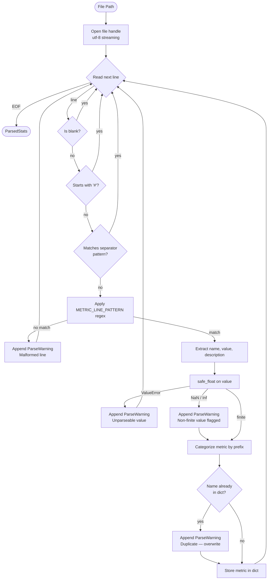

### Single-Pass Guarantee

The parser reads every byte of the file **exactly once**. There is no backtracking, no re-reading, and no loading the entire file into memory. This ensures O(n) time and O(m) space where m is the number of distinct metrics.

---

## 14. Regex Specification

Patterns are compiled **once at module import** in [`utils/regex.py`](../utils/regex.py).

### `METRIC_LINE_PATTERN`

Matches a single metric line in the format:
```
<metric_name>   <value>   [# <description>]
```

```python
r"^\s*(?P<name>[A-Za-z0-9_:.<>\[\]]+)\s+"
r"(?P<value>[-+]?(?:\d+\.\d+(?:[eE][-+]?\d+)?|\d+(?:[eE][-+]?\d+)?|nan|inf|-inf))"
r"(?:\s+(?:\d+(?:\.\d+)?\s+)?#\s*(?P<description>.*))?\s*$"
```

**Named capture groups:**

| Group | Content | Example |
|-------|---------|---------|
| `name` | Dotted metric identifier | `system.cpu.numCycles` |
| `value` | Integer / float / sci-notation / nan / inf | `614665`, `1.234500e+00`, `nan` |
| `description` | Optional trailing comment | `Number of cpu cycles simulated` |

### `SEPARATOR_LINE_PATTERN`

Matches gem5 section dividers:
```
---------- Begin Simulation Statistics ----------
```

```python
r"^[\s\-=]*$|^-{2,}.*-{2,}$"
```

### `UNIT_PATTERN`

Extracts unit strings from descriptions:
```
Simulator tick rate (ticks/s)
```

```python
r"\(([^()]+)\)\s*$"
```

---

## 15. Validation Rules

`MetricValidator` checks are applied after extraction. None of these halt parsing — they produce warning messages surfaced in `metadata.warnings`.

| Check | Rule | Message Format |
|-------|------|---------------|
| Missing required | Metric in `ALL_REQUIRED_METRICS` not in parsed set | `Missing required metric: '<name>'` |
| NaN value | `math.isnan(value)` | `Metric '<name>' has an invalid value: nan` |
| Infinity | `math.isinf(value)` | `Metric '<name>' has an invalid value: inf` |
| Negative cycles | Value < 0 for non-negative metrics | `Metric '<name>' has an impossible negative value: <v>` |
| Divide-by-zero risk | Denominator metric equals 0 | `Potential divide-by-zero: '<name>' is 0` |
| Duplicate metric | Same name seen twice | `Duplicate metric '<name>' overwritten with later value` |
| Malformed line | Line does not match `METRIC_LINE_PATTERN` | `Malformed metric line: '<line>'` |

**Non-negative metrics checked:**
- `system.cpu.numCycles`
- `system.cpu.instsIssued`
- `system.cpu.instsAdded`
- `simTicks`
- `simInsts`
- `simOps`

**Required metrics (warnings when absent):**

*Simulation:* `simSeconds`, `simTicks`, `finalTick`, `simFreq`, `hostSeconds`, `hostTickRate`, `hostMemory`, `simInsts`, `simOps`, `hostInstRate`, `hostOpRate`

*CPU:* `system.cpu.numCycles`, `system.cpu.cpi`, `system.cpu.ipc`, `system.cpu.instsIssued`, `system.cpu.instsAdded`

---

## 16. Caching Strategy

`ResultCache` in [`services/cache.py`](../services/cache.py) is a **thread-safe, TTL-based in-memory dict**.

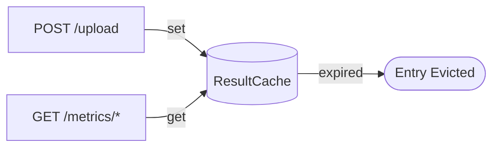

| Property | Value |
|----------|-------|
| Implementation | `dict` + `threading.Lock` |
| Key | `file_id` (UUID4 hex) |
| Value | `PipelineResult` / `str` filename |
| Default TTL | **3600 seconds (1 hour)** |
| Eviction policy | Lazy — checked on `get()` |
| Thread safety | `threading.Lock` protects all reads/writes |
| Multi-process | ⚠ Not shared across workers — use Redis for production |

> **Production note:** For gunicorn with `--workers > 1`, replace `ResultCache` with a Redis-backed implementation behind the same `get/set/delete` interface.

---

## 17. Error Handling Reference

### HTTP Status Code Map

| Code | Meaning | Triggered by |
|------|---------|-------------|
| 200 | OK | Successful GET |
| 201 | Created | Successful POST /upload |
| 400 | Bad Request | Invalid input (extension, empty file, etc.) |
| 404 | Not Found | Unknown `file_id`, unknown route |
| 405 | Method Not Allowed | Wrong HTTP verb |
| 413 | Payload Too Large | File exceeds 200 MB |
| 422 | Unprocessable Entity | Valid file but un-parseable content |
| 500 | Internal Server Error | Unexpected exception |

### Error Envelope

All errors return:
```json
{
  "error": "<snake_case_code>",
  "message": "<human readable description>"
}
```

### Exception Handling in `upload_file()`

```
FileNotFoundError   →  500 upload_failed
OSError             →  500 upload_failed  (save) / 422 corrupted_file (parse)
ValueError          →  422 corrupted_file
```

---

## 18. Configuration Reference

Configuration lives in [`config.py`](../config.py). Use `Config.from_env()` in production; `TestConfig` is used automatically by pytest.

| Attribute | Default | Type | Description |
|-----------|---------|------|-------------|
| `BASE_DIR` | `Path(__file__).parent` | `Path` | Backend root directory |
| `UPLOAD_FOLDER` | `BASE_DIR / "uploads"` | `Path` | Directory for uploaded files |
| `MAX_CONTENT_LENGTH` | `200 * 1024 * 1024` (200 MB) | `int` | Maximum upload body size |
| `JSON_SORT_KEYS` | `False` | `bool` | Preserve insertion order in JSON |
| `DEBUG` | `False` | `bool` | Flask debug mode |
| `TESTING` | `False` | `bool` | Flask testing mode |

**Environment Variables:**

| Variable | Effect |
|----------|--------|
| `FLASK_DEBUG=1` | Enables debug mode + auto-reload |

**`TestConfig` overrides:**
- `TESTING = True`
- `UPLOAD_FOLDER = BASE_DIR / "tests" / "_tmp_uploads"`

---

## 19. Logging Reference

All modules use `get_logger(__name__)` from [`utils/logger.py`](../utils/logger.py). The root logger is configured **exactly once** at first import.

**Log format:**
```
2026-07-20 17:30:00,123 | INFO     | services.pipeline | Pipeline started: /uploads/abc_stats.txt
```

| Logger name | Key events logged |
|-------------|-----------------|
| `api.upload` | File saved, upload success/failure, parse errors |
| `services.pipeline` | Pipeline start/finish, timing, metric count |
| `services.extractor` | Extraction complete: line count, metric count, warnings |
| `services.calculator` | Derived metric calculation failures (WARNING level) |
| `api.metrics` | Each metrics endpoint request (INFO) |
| `app` | Application created, unhandled errors (ERROR + traceback) |

**Log levels used:**

| Level | When |
|-------|------|
| `INFO` | Normal operations: upload, parse, request served |
| `WARNING` | Non-fatal issues: calculation failures, unknown file_id |
| `ERROR` | OS errors, parse failures |
| `EXCEPTION` | Unhandled 500 errors (includes stack trace) |

---

## 20. Running Tests

```bash
# Activate virtual environment first
source venv/bin/activate

# Run all tests with coverage report
pytest --cov=. --cov-report=term-missing -v

# Run individual test modules
pytest tests/test_parser.py    -v     # Parser + Extractor
pytest tests/test_calculator.py -v    # Calculator
pytest tests/test_validator.py  -v    # Validator
pytest tests/test_api.py        -v    # REST API (integration)

# Coverage only (no verbose)
pytest --cov=. --cov-report=term-missing

# HTML coverage report
pytest --cov=. --cov-report=html
open htmlcov/index.html

# Code quality checks
ruff check .
black --check .
black .   # auto-format
```

**Coverage target: >95%**

### Test Summary by Module

| Test File | What It Tests | Key Scenarios |
|-----------|--------------|---------------|
| `test_parser.py` | `StatsParser`, `MetricExtractor` | Streaming, comments, separators, sci-notation, duplicates, empty file, auto-discovery |
| `test_calculator.py` | `MetricCalculator` | All 8 derived metrics, zero-division, missing inputs, NaN guard, `calculate_all()` |
| `test_validator.py` | `MetricValidator` | Missing required, NaN/Inf, negative cycles, divide-by-zero, warning propagation |
| `test_api.py` | All REST endpoints | Upload happy path, 6 error codes, all GET endpoints, 404/405 |

---

## 21. Design Principles & SOLID

| Principle | How It's Applied |
|-----------|-----------------|
| **S**ingle Responsibility | `StatsParser` streams lines; `MetricExtractor` parses them; `MetricCalculator` computes derivations — no cross-cutting concerns |
| **O**pen/Closed | New gem5 metrics are auto-discovered without modifying any existing code; new derived metrics add one method + one dict entry |
| **L**iskov Substitution | `TestConfig` fully substitutes for `Config`; `ResultCache` interface is swappable (e.g., Redis) |
| **I**nterface Segregation | API routes import only what they need; `metrics.py` doesn't import parser internals |
| **D**ependency Injection | `AnalysisPipeline` accepts a `MetricValidator` override; tests pass mock collaborators |
| **Pure functions** | All `MetricCalculator` methods: same inputs → same output, no mutation |
| **Type safety** | Every function annotated; Pydantic v2 validates all API contract boundaries |
| **O(n) complexity** | Single file pass; dict lookups O(1); regex compiled once; no nested loops over metrics |

---

## 22. Extending the Backend

### Adding a New Required Metric

Edit [`utils/constants.py`](../utils/constants.py) only:

```python
REQUIRED_SIMULATION_METRICS: frozenset[str] = frozenset({
    ...
    "system.l2cache.overallHits",   # ← add here
})
```

**Zero parser changes required.** If the metric appears in any `stats.txt`, it is automatically extracted, categorized, and returned in the API.

---

### Adding a New Derived Metric

1. Add a method to [`services/calculator.py`](../services/calculator.py):

```python
def calculate_branch_misprediction_rate(self) -> float | None:
    """Branch misprediction rate = condIncorrect / condPredicted.

    Returns:
        Misprediction rate as a fraction, or None if inputs are missing.
    """
    incorrect = self._value("system.cpu.branchPred.condIncorrect")
    predicted  = self._value("system.cpu.branchPred.condPredicted")
    if incorrect is None or predicted is None:
        return None
    return safe_divide(incorrect, predicted)
```

2. Register it in `calculate_all()`:

```python
"branchMispredictionRate": self.calculate_branch_misprediction_rate,
```

3. Add a test in `tests/test_calculator.py`.

---

### Adding a New Metric Category

Edit [`utils/constants.py`](../utils/constants.py):

```python
MEMORY_METRIC_PREFIXES: tuple[str, ...] = ("system.mem_ctrl",)
```

Add the new `MetricCategory` enum value to [`models/metric.py`](../models/metric.py) and update `MetricExtractor._categorize()` in [`services/extractor.py`](../services/extractor.py).

---

### Supporting New gem5 Output Files (e.g., `config.ini`)

1. Create `services/config_parser.py` with the same `iter_lines()` interface.
2. Create `services/config_extractor.py`.
3. Register a new Blueprint in `api/config_metrics.py`.
4. Register the blueprint in `api/routes.py`.

No changes to the existing parser, extractor, or calculator are required.

---

## 23. Performance Characteristics

| Metric | Characteristic |
|--------|---------------|
| Time complexity | **O(n)** where n = number of lines in `stats.txt` |
| Space complexity | **O(m)** where m = number of distinct metrics |
| Regex compilation | Once at import; **O(1)** per line match |
| Cache lookup | **O(1)** dict lookup by file_id |
| File reads after upload | **Zero** — results are cached in-memory |
| Concurrent request safety | `threading.Lock` guards all cache operations |
| Streaming | File is **never** fully loaded into memory |

**Typical timing for a 10,000-line `stats.txt`:** < 50 ms on modern hardware.

---

## 24. Security Considerations

| Risk | Mitigation |
|------|-----------|
| Path traversal via filename | `werkzeug.utils.secure_filename()` applied before saving |
| Oversized uploads | `MAX_CONTENT_LENGTH = 200 MB`; Flask returns 413 automatically |
| Non-.txt files | Extension whitelist enforced before saving to disk |
| Zip bombs / decompression | No decompression performed; raw byte count checked |
| Regex DoS (ReDoS) | Patterns anchored with `^` and `$`; no catastrophic backtracking |
| Sensitive data in logs | Only metric counts and timing are logged — no metric values |
| Cache poisoning | File IDs are UUID4 hex — not guessable |

> **Note:** This backend is designed for trusted-network / internal deployment. Add authentication middleware (e.g., JWT, API keys) before exposing to public networks.

---

## 25. Deployment Guide

### Development

```bash
FLASK_DEBUG=1 python app.py
```

### Production with Gunicorn

```bash
pip install gunicorn

gunicorn "app:create_app()" \
  --bind 0.0.0.0:5000 \
  --workers 2 \
  --threads 4 \
  --timeout 120 \
  --access-logfile - \
  --error-logfile -
```

> ⚠ **Multi-worker cache:** With `--workers > 1`, the in-memory `ResultCache` is **not shared** between workers. Use Redis and swap `ResultCache` with a Redis client behind the same interface.

### Docker (example)

```dockerfile
FROM python:3.12-slim
WORKDIR /app
COPY requirements.txt .
RUN pip install --no-cache-dir -r requirements.txt
COPY . .
EXPOSE 5000
CMD ["gunicorn", "app:create_app()", "--bind", "0.0.0.0:5000", "--workers", "2"]
```

```bash
docker build -t gem5-backend .
docker run -p 5000:5000 gem5-backend
```

### Environment Variables Summary

| Variable | Required | Description |
|----------|----------|-------------|
| `FLASK_DEBUG` | No | Set `1` for development auto-reload |
| `FLASK_APP` | No | Defaults to `app.py` |

---

*Documentation generated for gem5 Stats Analysis Backend — Python 3.12+ / Flask 3.x / Pydantic v2*
