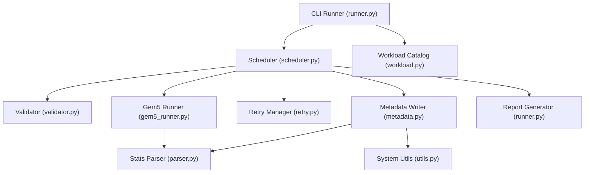
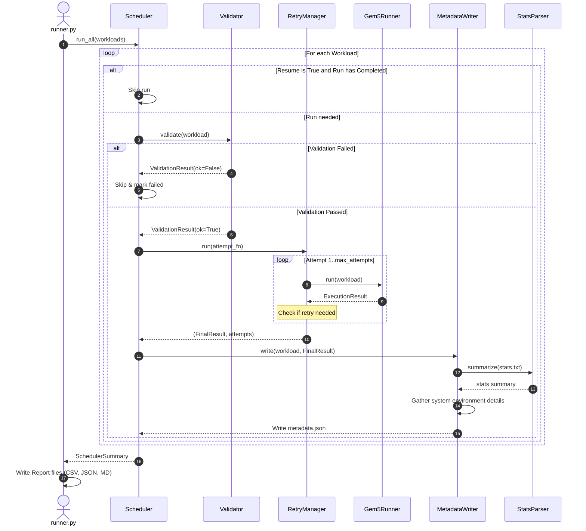

# gem5 Trace Generation Automation Framework for RISC-V Research

A production-quality benchmark execution and collection framework for computer architecture research. This framework automatically orchestrates batch simulation runs, monitors system constraints, recovers from failures, and persists detailed reproducibility logs alongside simulation trace files.

---

## Features

- **Automated Orchestration**: Orchestrate 100+ RISC-V workloads across multiple suites (CoreMark, Embench, PolyBench, MiBench, GAPBS, NPB, PARSEC).
- **OOP Architecture**: Modular, typed execution, scheduling, validation, and metadata pipelines conforming to SOLID principles.
- **Fail-Safe Scheduling**: Robust handling of timeouts, page segmentation faults (Signal 11), out-of-memory errors (Signal 9), and missing outputs.
- **Automatic Retries**: Exponential backoff and retry policies logic configurable per failure mode.
- **Parallel & Resume Executions**: Multi-threaded or multi-process concurrent runner with execution state persistence to resume interrupted sweeps.
- **Research Reproducibility**: Log host system info (OS description, physical CPU, memory size), active environment variables, git commit hash, binary/input SHA-256 signatures, and library versions.
- **Visual Reporting**: Automated compilation of CSV, JSON, and Markdown summaries.

---

## Project Directory Tree

```text
workloadCollector/ (or gtrace-benchmark/)
│
├── config/
│   ├── workloads.yaml        # Auto-generated specs for ~100 RISC-V runs
│   ├── simulator.yaml        # gem5 target parameters (executable, CPU, caches)
│   ├── environment.yaml      # System validation rules, directory paths
│   ├── logging.yaml          # Log layout parameters and file rotations
│   └── metadata_schema.json  # Validation rules for output logs
│
├── benchmarks/               # Workspace for target executable binaries
│   ├── embench/
│   ├── polybench/
│   ├── mibench/
│   ├── coremark/
│   ├── gapbs/
│   ├── npb/
│   ├── parsec/
│   └── custom/
│
├── outputs/                  # Results (stats.txt, trace.log, metadata.json)
│
├── logs/                     # Main scheduler logs
│
├── scripts/
│   ├── runner.py             # CLI parser and workflow coordinator
│   ├── scheduler.py          # Parallel and sequential batch controller
│   ├── gem5_runner.py        # Subprocess manager for individual runs
│   ├── workload.py           # Dataclass wrappers and configuration parser
│   ├── metadata.py           # Reproducibility metadata compiler
│   ├── logger.py             # Centralized logging configuration
│   ├── validator.py          # Pre-flight environment verify checks
│   ├── parser.py             # stats.txt key metric parser
│   ├── retry.py              # Retry manager with backoff multiplier
│   └── utils.py              # System diagnostics helpers
│
├── reports/                  # Aggregated execution logs (CSV, JSON, MD)
│
├── README.md
└── requirements.txt
```

---

## Installation & Setup

1. **Clone the repository and enter the directory**:
   ```bash
   cd workloadCollector
   ```

2. **Install Python dependencies**:
   ```bash
   pip3 install -r requirements.txt
   ```

3. **Verify the gem5 target path**:
   Configure the gem5 bin path and target config script within `config/simulator.yaml`:
   ```yaml
   gem5:
     executable: "/usr/bin/gem5.opt"
     config_script: "configs/deprecated/configs/example/se.py"
   ```

---

## Architecture & Workflows

### Component Architecture



### Execution Workflow



---

## CLI Execution Examples

The framework provides an `argparse` command line interface inside [runner.py](file:///run/media/vedha/E/gtrace/workloadCollector/scripts/runner.py).

### Basic Dry-run Execution (No gem5 Installation Needed for Testing)
Test scheduling, validation, and reporting pipelines immediately:
```bash
python3 scripts/runner.py --dry-run
```

### Execute a Specific Benchmark Suite (e.g. Polybench)
```bash
python3 scripts/runner.py --suite polybench
```

### Filter Down to a Single Benchmark
```bash
python3 scripts/runner.py --suite polybench --benchmark gemm
```

### Run a Sweep with Custom Repetitions
```bash
python3 scripts/runner.py --suite coremark --repeat 5
```

### Multi-threaded Parallel Processing
Run multiple gem5 instances concurrently with 8 parallel worker threads:
```bash
python3 scripts/runner.py --parallel 8 --parallel-mode threads
```

### Resume an Interrupted Simulation Batch
Skip all runs that successfully generated a `metadata.json` with a `"success"` status, only running failed or missing simulations:
```bash
python3 scripts/runner.py --resume
```

### Enable Debug Verbose Mode
Prints detailed startup messages, commands built, and subprocess validation details:
```bash
python3 scripts/runner.py --verbose
```

---

## Output Structure

For every run of a benchmark, files are cataloged dynamically inside the `outputs` directory:

```text
outputs/
└── coremark_coremark_100k/
    └── run_001/
        ├── trace.log          # Simulated instruction debug trace (gem5)
        ├── stats.txt          # Raw gem5 statistics metrics file
        ├── config.ini         # gem5 configuration ini dump
        ├── config.json        # gem5 configuration JSON dump
        ├── stdout.txt         # gem5 subprocess stdout
        ├── stderr.txt         # gem5 subprocess stderr
        ├── execution.log      # Logging messages dedicated to this specific run
        └── metadata.json      # Complete reproducibility and metrics record
```

### Example reproducibility log (`metadata.json`)
```json
{
  "benchmark_name": "coremark_100k",
  "suite": "coremark",
  "category": "performance",
  "execution_time_seconds": 12.35,
  "simulation_ticks": 24700000000,
  "simulation_seconds": 24.7,
  "committed_instructions": 100000000,
  "host_name": "research-station-01",
  "cpu_model": "DerivO3CPU",
  "isa": "riscv",
  "memory": "512MB",
  "cache": {
    "l1d_size": "16kB",
    "l1i_size": "16kB",
    "l2_size": "256kB"
  },
  "gem5_version": "gem5 Simulator System v24.0.0.0",
  "git_commit": "a3b4c5d6e7f8",
  "date": "2026-07-13T19:30:15",
  "binary_hash": "e3b0c44298fc1c149afbf4c8996fb92427ae41e4649b934ca495991b7852b855",
  "input_hash": "none",
  "return_code": 0,
  "trace_size_bytes": 1048576,
  "stats_size_bytes": 4500,
  "execution_status": "success",
  "attempt": 1,
  "error_message": null,
  "reproducibility": {
    "python_version": "3.12.1",
    "operating_system": "Linux 6.6.10-arch1-1 (x86_64)",
    "host_cpu": "AMD Ryzen 9 5950X 16-Core Processor",
    "host_memory": "64.00 GB",
    "environment_variables": {
      "PATH": "/usr/local/bin:/usr/bin"
    },
    "installed_packages": [
      "PyYAML==6.0.1",
      "jsonschema==4.20.0"
    ]
  }
}
```

---

## Troubleshooting & Extensibility

### How to Add a New Custom Benchmark Suite
1. Modify `config/workloads.yaml` directly without changing python code:
   ```yaml
   workloads:
     - id: "custom_mybench"
       name: "mybench"
       suite: "custom"
       category: "database"
       binary: "benchmarks/custom/mybench"
       working_directory: "benchmarks/custom"
       arguments: ["--size", "small"]
       timeout: 600
       enabled: true
   ```
2. Place the binary inside `benchmarks/custom/mybench`.
3. Execute the custom filter:
   ```bash
   python3 scripts/runner.py --suite custom
   ```

### Overriding Simulation limits
If a benchmark needs customized timeout limits, modify its specific `timeout` parameter in `config/workloads.yaml`. If global constraints (e.g. max instructions simulated) need adjusting, update `config/simulator.yaml`:
```yaml
limits:
  max_instructions: 5000000  # Update instructions cap
```
