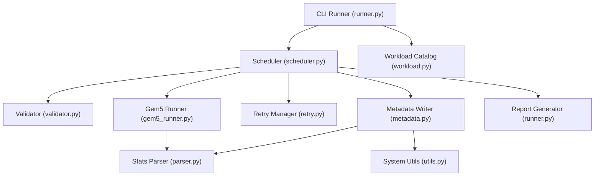
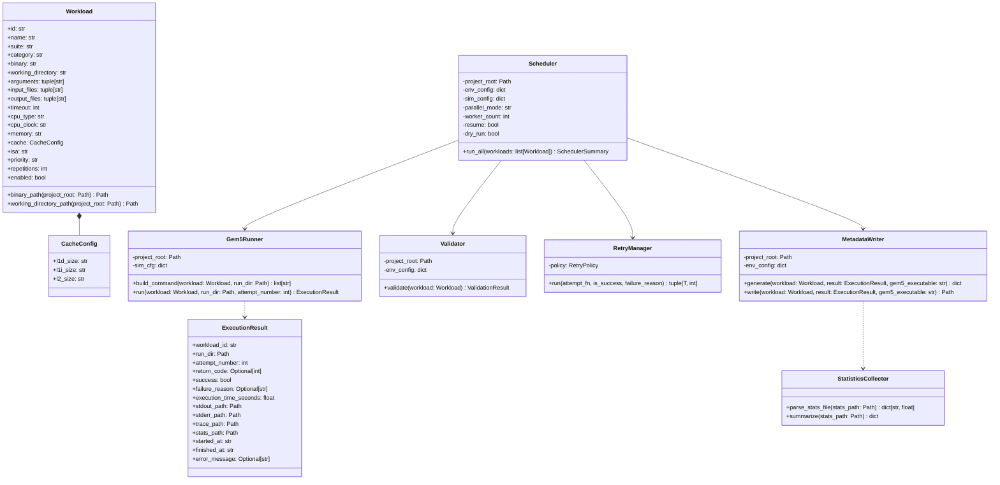
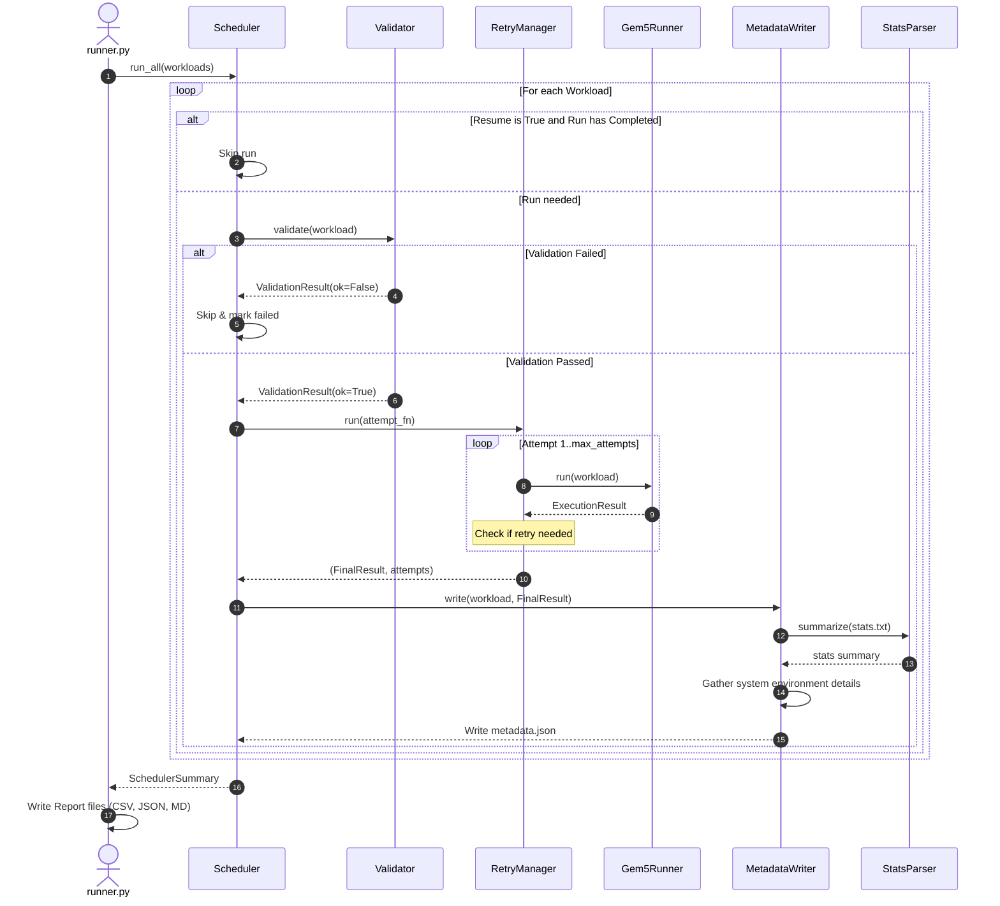

# Implementation Plan - gem5 Trace.log RISC-V Benchmark Automation Framework

This plan details the architecture and implementation steps to develop a production-quality benchmark execution and collection framework for gem5. It is designed to manage and run ~100 RISC-V benchmark workloads, capture debug traces, extract execution metrics, handle process failures/retries, and persist system metadata for research reproducibility.

## System Architecture (Mermaid)

The following Mermaid diagram shows the layout of our framework's software components and their relations:

## Class Diagram (Mermaid)

## Batch Execution Sequence (Mermaid)

## User Review Required

> [!IMPORTANT]
> - **Project Root**: All file creation will occur inside `/run/media/vedha/E/gtrace/workloadCollector/` to match the directory where existing scripts like [logger.py](file:///run/media/vedha/E/gtrace/workloadCollector/scripts/logger.py) are placed.
> - **Dry-Run Capabilities**: Since actual gem5 runs can require minutes to hours per benchmark and need target RISC-V binaries, the framework will support a robust `--dry-run` mode which skips binary checks and launches mock executions. This allows immediate testing of the entire scheduler, progress reporting, and output creation infrastructure.

## Proposed Changes

### Configuration Layer

Create YAML files under the `config` directory to customize execution options without modifying Python code.

#### [NEW] [workloads.yaml](file:///run/media/vedha/E/gtrace/workloadCollector/config/workloads.yaml)
Stores approximately 100 workloads mapping across CoreMark, Embench, Polybench, MiBench, GAPBS, NPB, and PARSEC suites.
*Because 100 workloads would result in a massive file (~2000 lines), we will construct a Python generator script to initialize it programmatically with rich parameters, ensuring completeness without placeholder entries.*

#### [NEW] [simulator.yaml](file:///run/media/vedha/E/gtrace/workloadCollector/config/simulator.yaml)
Defines target simulator paths (gem5 executable, CPU type, memory config, caches, limit parameters, debug flags, and retry parameters).

#### [NEW] [environment.yaml](file:///run/media/vedha/E/gtrace/workloadCollector/config/environment.yaml)
Contains system execution options, resource limitations (e.g., minimum disk space limits), and path structures.

#### [NEW] [logging.yaml](file:///run/media/vedha/E/gtrace/workloadCollector/config/logging.yaml)
Specifies parameters for console log formats, file paths, log levels, and backup rotations.

#### [NEW] [metadata_schema.json](file:///run/media/vedha/E/gtrace/workloadCollector/config/metadata_schema.json)
Specifies JSON Schema representation for `metadata.json` ensuring standard verification of output metrics.

---

### Scripts Layer

Create the missing Python logic to run the scheduler, handle metadata composition, and process CLI input.

#### [NEW] [metadata.py](file:///run/media/vedha/E/gtrace/workloadCollector/scripts/metadata.py)
Collects host system details (OS, CPU, memory), imports parsed simulation metrics (ticks, committed instructions, etc.), captures hashes of inputs/binaries, and writes `metadata.json`.

#### [NEW] [scheduler.py](file:///run/media/vedha/E/gtrace/workloadCollector/scripts/scheduler.py)
Orchestrates batch runs sequentially or in parallel using `ProcessPoolExecutor` or `ThreadPoolExecutor`. Updates progress reports, filters runs to support resume, and aggregates simulation results.

#### [NEW] [runner.py](file:///run/media/vedha/E/gtrace/workloadCollector/scripts/runner.py)
Initializes configurations, loads catalog entries, parses command line options, triggers scheduling, and compiles performance reports (CSV, JSON, MD) inside a `reports/` folder.

---

### Project Metadata Layer

#### [NEW] [requirements.txt](file:///run/media/vedha/E/gtrace/workloadCollector/requirements.txt)
Specifies necessary dependencies like `PyYAML` and `jsonschema`.

#### [NEW] [README.md](file:///run/media/vedha/E/gtrace/workloadCollector/README.md)
Comprehensive installation and execution instructions.

---

## Verification Plan

### Automated Verification
Run the runner using dry-run modes to verify the control flow:
- `python3 scripts/runner.py --dry-run` (Sequential dry run)
- `python3 scripts/runner.py --dry-run --parallel 4` (Parallel dry run with 4 workers)
- `python3 scripts/runner.py --dry-run --suite polybench` (Filtering by suite)
- `python3 scripts/runner.py --dry-run --repeat 2` (Testing repetition counting)

### Manual Verification
Inspect the outputs:
- Check that report files are written successfully under `reports/`.
- Verify the schema validation of generated `metadata.json` files.
- Inspect the log messages and progress console displays.
